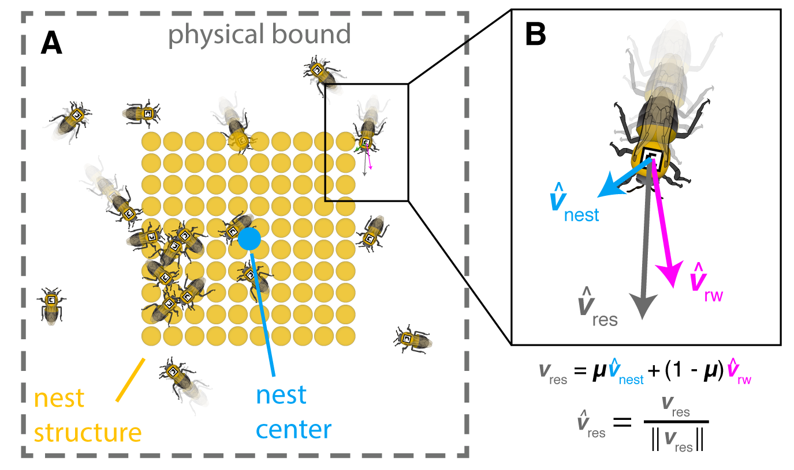

# BeeNestABM
BeeNestABM: An open-source agent-based model of spatiotemporal distribution of bumblebees in nests

Code:

Paper:

Figure 1: Snapshot of sample BeeNestABM results: positions of bees (blue dots), queen (large red circle) and nest structures (yellow, white, and gray circles).

## Authors
Ashlee N. Ford Versypt, School of Chemical Engineering, Oklahoma State University, ashleefv@okstate.edu

James D. Crall, Department of Organismic and Evolutionary Biology, Harvard University, jcrall@oeb.harvard.edu

Biswadip Dey, Department of Mechanical & Aerospace Engineering, Princeton University, biswadip@princeton.edu

## Overview
This software features the MATLAB source code for an interactive computational model that can be used to study the localized responses 
of bumblebees to sublethal exposures to a prevalent class of pesticides called neonicotinoids. The code involves an agent-based stochastic model for the interactions between and movements of individual bees within a nest and the nest-related disruptions that occur due to pesticide exposure. The dynamic states of the bees are stored in a matrix, the default data structure of MATLAB. Agent-based modeling allows for building understanding of the colony scale impacts of multiple interacting factors that affect numerous individuals in close proximity and how those change upon pesticide exposure. The scientific significance is that the model solved in the software focuses on the effects of pesticides that occur in bumblebees over short time scales (hours to days) inside a single nest. These temporal and spatial scales are appropriate for modeling the effects of neonicitinoid pesticides that account for colony size and interactions between exposed and unexposed individuals. The short and local scales allow the model to explicitly consider neighbor interactions and individual bee interactions with structures inside an isolated environment without confounding external factors. Novel research results using this software for scientific applications have been obtained (Crall et al. 2018a, 2018b).

To facilitate model reuse and reproducible computational research, we have followed the Overview, Design concepts, and Details (ODD) protocol (Grimm et al. 2006, 2010) for standardizing communication of agent-based models. The purpose of this agent-based model is to track the movements of individual bees within a nest chamber on relatively short time scales (a few seconds to less than one day) considering interactions with nestmates and nest structures such as food or brood pots. The entities are the bumblebees. 

## Entities, state variables, and scales
The entities are characterized by the following state variables that are updated at each time step: the x- and y-coordinates, the velocity, the activity state, and the directional heading angle. The states are stored in the nestSimulationData 3-dimensional MATLAB matrix. The simulation environment also includes nest stuctures--full and empty food pots and brood pots--dispersed throughout the nest. The model considers collectives of bees that are on or off of the nest based on their locations relative to the nest structures. The default length scales are the nestMaxX and nestMaxY settings set to 25 cm and 20 cm, respectively for the dimensions of the nest. The bees have size BeeBodyThreshold = 1 cm. The time step is 1/frequency, where the default frequency is 2 Hz, and a simuation runs for  for totalTimePoints, which has typical values between 600 and 7200 for 5-60 min of simulated time. 

## Process overview and scheduling
The BeeNestABM model tracks bumblebee activity and motility using empirically estimated probabilities for transitions between active (mobile) and inactive states (Fig. 2A). The location of a bee in relation to the structures such as brood and food pots within the nest influence the transition probabilities and the orientation of bee movement through a combination of random walk and attraction toward the nest structures (Fig. 2B). The transition probabilities contain a component that considers whether the transition is occuring spontaneously or due to social modulation upon collison with a neighboring bee (Fig. 2C).

Figure 2: Phenomena considered in transition probabilities

The following rules or submodels are executed in rules.m:
  1. Check whether or not bees are close enough for social interactions.
  2. Transition between active (moving) and inactive (stationary) states.
  3. Move with some velocity and at some angle heading (0-2 pi in 2D) from the current position (Figure 3). 
    a. velocity: Bees that were previously inactive are set at a velocity selected from the empirically determined distribution of bee velocities. Bees that were already moving have two options for velocities: if the resampled velocity from the distribution is +/- 20% of the current velocity, it is updated, but if the sample velocity is outside this range, then velocities have a 10% probability of switching to the sample value and 90 % probability of staying at the current velocity. 
    b. angle: First, an angle perturbed within +/- perturbationAngle of the current angle heading is calculated as the random walk angle. Next, the pairwise distances between a bee and the collection of other nestmates and the nest structures (itemized by brood, empty food pots, and full food pots) are calculated along with the angles of the resultant total distance vectors for each category. The attractions to the nestmates and the nest structures are specified as attraction weights called lambda (the current values have all three types of nest structures lumped together and no attraction toward nestmates). These are collectively referred to as the  environmental stimuli. The net angle for the environmental stimuli is the mean in polar coordinates of the angles between each bee and the nestmates and structures in the nest weighted by their attraction lambda values. The net environmental stimuli angle and the random walk angle are combined by a weighted mean in poloar coordinates with the weight of the environmental stimuli set to different weights for different cohorts (default values stored in rules.m) and the random walk deviations weighted at 1-environmental stimuli weight. 
  4. Truncate a bee's movement if it hits the wall.
      
   After the four rules are called, all the states are updated for the next iteration.
  

Figure 3: Phenomena considered in bee movement submodel 

## Design concepts

### Basic principles
A key concept of the model is to include rules for bumblebee behaviors inside nests of different sizes and populations that can be modulated upon sublethal exposure to pesticides. These behaviors relate to the portion of the time spent on the nest, the portion of time spent actively moving, the interaction rate of bees with each other, and the spatial distributions of bee movements throughout the nest. These are taken into account through the transition probabilities of switching from active to inactive and vice versa under different conditions, the attractions toward the nest structures, and movement of bees at a distribution of different velocities.

### Emergence
Differences between control and exposed bees are expected to emerge regarding the aggregate proportion of time spent on the nest, the spatial distributions of bees, the aggregate average distance to the nest center, the average proportion of time spent actively moving, and the number of bee interactions per timestep. Additionally, through changing the density of bees in a colony, the emergent behavior  called “social buffering” can be assessed whereby increased interactions with nestmates in dense colonies may modulate (either mitigate or exacerbate) the effects of pesticide exposure on individuals.  

### Adaptation
Based on empirical evidence, it was deemed that pesticide exposed individuals have modified transition probabilities compared to the control population. We also consider the bees of both types to resist large fluctuations in their directional heading or velocity, with only a low probability of abrupt changes being acceptable.

### Sensing
The distances to neighbors and to nest structures are used for individuals to sense their positions within their environments. Neighbors are considered to come into contact or "bump" if their coordinates are within BeeBodyThreshold of each other. The environmental stimuli weight serves to attract bees toward the center of nest structures rather than simply following a random walk directional heading within +/- perturbationAngle from their previous heading. Also, if the bees are on or off the nest, they are given different location-based transition probabilities to represent the concept that bees working on nest-structure maintainance functions have a different propensity to move compared to individuals that are not performing those duties.

### Interaction
When bees come into direct contact, this changes the probabilities for transitioning between active and inactive states. This is refered to as the socially-modulated social interaction state.

### Stochastisticity

The starting positions and velocities are generated from a distribution, thus they will be different for each simulation. The transition from active to inactive states or vice versa is updated stochastically at each time step. The velocity is updated from a sampled distribution with a probability velocityPerturbationMightAcceptProb for accepting an updated velocity outside of a window of velocityPerturbationAlwaysAccept fraction around the currentVelocity. The randomWalkAngle is a stochastic change within +/- perturbationAngle from the current directional heading.

### Observations
Bee coordinates are plotted, and animations of the bee movements over time can be shown as simulation output to visualize spatial distributions over time. Additional statistics are gathered based on the means over all time steps and all bees for the following calculated metrics (calculateSummaryStatistics.m): activity (moving or not), distance to other bees, distance to nest structures, distance to the social center of the nest, and portion of time spent on the nest.

## Initialization
To use a sample bumblebee colony as the starting population of bees with experimentally observed nest structure layout and initial positions, run either optimizerShellSpatial.m or localSensitivity.m described below in the Main files section with colonyNumber = 1. The initial states for the x- and y-coordinates for each bee are sampled from a normal distribution that was fitted to the colony 1 data. The initial velocity states for the bees are randomly sampled from a Weibul distribution fitted to the colony 1 data. The initial activity states are assigned based on the proportion of the entire experiment duration (1 hour) that bees in colony 1 were active or inactive. exposure_state may be switched between "pre" and "post" to denote a control population and one experimentally observed population with a individuals in cohorts of control, very low exposure, and significant sublethal exposure. The positions of the brood and full and empty food pots are set based on the colony 1 observed locations. The transition probabilities and the environmental stimuli weight were estimated from experimental data for the colony.

To customize a simulation, run modelBeeScript.m. The user can specify the nest chamber sizes, the number of bees, the number of simulation replicates, the fraction of bees that are "treated" or exposed to the pesticide, the fraction of the domain uniformly covered by nest structures in a central zone, the spacing between the nest structures in the central occupied zone, the environmental stimuli weights for untreated and for treated bees, and the number of time steps for the simulation.  

## Input data

The empirically-driven simulation files (see Main files section below) use experimental observations of a colony to populate the initial conditions. The transition probabilities or "motion parameters" from parameterEstimates.csv and the empirically-based velocity distribution are needed to update properties dynamically during the simulation.

## Submodels

The file rules.m and its dependent files contain the 5 submodels for the agent-based model that are updated during each time step. These are summarized in the Process overview and scheduling section above. Here, we provide pseudocode and comments for the implementation of the submodels in rules.m.

### Submodel 1: Check whether or not bees are close enough for social interactions.
First, we calculate pairwise distances between the bees. Pairwise distances are computed using pdist2, a built-in function in MATLAB, and are stored in a vector called currentDistanceToBees.

    currentDistanceToBees = pdist2(position,position); 

Then, we use a custom script called bump.m. The input is the currentDistanceToBees and a parameter BeeBodyThreshold that provides a spatial scale of interest in the model representing the average length of the body of a bee. The script sets a vector bumpedStorage values to 1 for bees that are considered to be close enough to interact and 0 otherwise. The interaction or "bump" is considered to happen if the bee is in the nest chamber (position is not NaN, which is only possible for time 0 initialized from data sets) and the pairwise distance between a pair of bees is less than BeeBodyThreshold. We exclude self-contact for bees as being considered as a bump.

    function bumpedStorage = bump()
    
    return bumpedStorage
    
    bumpedStorage = bump(BeeBodyThreshold,currentDistanceToBees);

PUT BUMP code here. Is output a vector or matrix?

### Submodel 2: Transition between active (moving) and inactive (stationary) states.
%% Define Transition Probability Vector 
% Probabilities for state transitions from active to inactive and inactive
% to active either with or without being bumped
transitionVector = zeros(size(bumpedStorage));
transitionVector(bumpedStorage == 0 & currentActivity == 1) = AtoI_Unbumped(bumpedStorage == 0 & currentActivity == 1);
transitionVector(bumpedStorage == 0 & currentActivity == 0) = ItoA_Unbumped(bumpedStorage == 0 & currentActivity == 0);
transitionVector(bumpedStorage == 1 & currentActivity == 1) = AtoI_Bumped(bumpedStorage == 1 & currentActivity == 1);
transitionVector(bumpedStorage == 1 & currentActivity == 0) = ItoA_Bumped(bumpedStorage == 1 & currentActivity == 0);

%% Switch States
% Use the output transition probability vector from the check bump rule to
% determine whether the active agents will stay active or become inactive
% and whether the inactive agents will stay inactive or become active

% Input:
%   Current activitivity indicator
% Output: 
%   Updated activitiy indicator at the current time step

% Check that the agent is in the domain. NaN cannot switch states
randomTransition = rand(size(currentActivity)); % sample from uniform distribution [0,1]
updatedActivity = currentActivity; % initialize
% if the agent is in the domain and the random transition probability is 
% less than the threshold in the transition vector, then the activity state 
% switch happens
% logical index for which bees switch
switch_idx = (isfinite(position(:,1))) & (randomTransition < transitionVector); 
updatedActivity(switch_idx) = 1-currentActivity(switch_idx); % switch activity state index
 
### Submodel 3: Move with some velocity and at some angle heading (0-2 pi in 2D) from the current position (Figure 3). 
    - velocity:  
    - angle: 
    
We calculate the pairwise distances between each bee and the brood and the food pots. The x- and y-coordinates of each bee are stored in a matrix called position. The coordinates of each nest object are stored in matrices corresponding to type: broodPosition, fullFoodPosition, and emptyFoodPosition.
    
    currentDistanceToBrood = pdist2(position,broodPosition);
    currentDistanceToFullFood = pdist2(position,fullFoodPosition);
    currentDistanceToEmptyFood = pdist2(position,emptyFoodPosition);
    
    we calculate the x- and y-components of the pairwise distances. This is the difference in x- and y-coordinates of objects relative to bee positions. We term these vectors Delta X & Y for the populations of bees, brood, full food pots, and empty food pots. We use a custom script called Delta_Obj calculate the DeltaX and DeltaY vectors. 
 
    Delta_Ojb = function()
    ...

    [DeltaX_Bees,DeltaY_Bees] = Delta_Obj(position,position);
    [DeltaX_Brood,DeltaY_Brood] = Delta_Obj(position,broodPosition);
    [DeltaX_FullFood,DeltaY_FullFood] = Delta_Obj(position,fullFoodPosition);
    [DeltaX_EmptyFood,DeltaY_EmptyFood] = Delta_Obj(position,emptyFoodPosition);

angles of resultant vectors for the current time step

% Input:
%   current position vectors, DeltaX and DeltaY vectors
% Output:
%   updated angles between bees and the angle of the resultant vector of 
%   the distance from all attractors of a given category (other nestmates,
%   brood, full full pots, and empty food pots)
angleBees = angleObj(currentDistanceToBees,DeltaX_Bees,DeltaY_Bees,cutoffRadius);% radians
angleBrood = angleObj(currentDistanceToBrood,DeltaX_Brood,DeltaY_Brood,cutoffRadius);% radians
angleFullFood = angleObj(currentDistanceToFullFood,DeltaX_FullFood,DeltaY_FullFood,cutoffRadius);% radians
angleEmptyFood = angleObj(currentDistanceToEmptyFood,DeltaX_EmptyFood,DeltaY_EmptyFood,cutoffRadius);% radians
    
    %% Move
% If the bee is active and in the nest, then compute the movement rules

% Input:
%   Updated activity state
%   Current position 
%   Current velocityPDF 
%   currentDistanceToBrood
%   currentDistanceToFullFood
%   currentDistanceToEmptyFood
%   currentDistanceToBees
%   weight parameters: lambda values and environmentalStimuliWeight
% Output:
%   Updated position

% logical index for which bees move
move_idx = (updatedActivity == 1) & (isfinite(position(:,1)));

% initialize such that if the sampled velocity not accepted, then the value 
% will default to the currentVelocity
updatedVelocity = currentVelocity;

% Velocity sampling from the velocityPDF distribution
proposedVelocity = 10.^random(velocityPDF,numBees,1); % m/s

% 100% acceptance within +/- velocityPerturbationAlwaysAccept of the
% currentVelocity
% idx is the index for the bees that satisfy the criteria
velocityPerturbationAlwaysAcceptAccept_idx = ...
    (proposedVelocity <= (1+velocityPerturbationAlwaysAccept).*currentVelocity) ...
    & (proposedVelocity >= (1-velocityPerturbationAlwaysAccept).*currentVelocity);

updatedVelocity(velocityPerturbationAlwaysAcceptAccept_idx) = proposedVelocity(velocityPerturbationAlwaysAcceptAccept_idx);

% velocityPerturbationMightAcceptProb acceptance rate outside of the window around
% the currentVelocity
% consider all that were not already accepted
velocityPerturbationMightAccept_idx = 1-velocityPerturbationAlwaysAcceptAccept_idx; 
velocityRandom = rand(size(proposedVelocity));
% set the velocityRandom for the already accepted where they will always
% fail the probability check below so that they are not manipulated again
velocityRandom(~velocityPerturbationMightAccept_idx) = 1; 
% idx is the index for the bees that satisfy the criteria
velocityPerturbationMightAccept_idx  = (velocityRandom < velocityPerturbationMightAcceptProb);
updatedVelocity(velocityPerturbationMightAccept_idx) = proposedVelocity(velocityPerturbationMightAccept_idx);

% find the bees that are moving that switched their activity this
% iteration 
switchToActive_idx = switch_idx & move_idx; 
% theese bees must now accept their sampled velocity rather than
% staying at zero with a high probability
updatedVelocity(switchToActive_idx) = proposedVelocity(switchToActive_idx);

% for bees that are not moving (inactive), set velocity to 0
updatedVelocity(~move_idx) = 0;

stepsize = updatedVelocity'.*dt;

% Random walk angle
%randomWalkAngle = currentAngle - pi/4+ (currentAngle + pi/4 -
%(currentAngle - pi/4) )*rand(1,numBees); % random perturbation within 
% +/- 45 degrees from currentAngle
randomWalkAngle = currentAngle' - perturbationAngle'+ 2*perturbationAngle'.*rand(1,numBees); %
% simplified math of the eqn above with generalized +/- perturbationAngle
% from currentAngle
% randomWalkAngle = 2*pi*rand(1,numBees); %random directions
% Net angle from environmental attractors
environWeights = [lambdaBees'; lambdaBrood'; lambdaFullFood'; lambdaEmptyFood'];
environAngles = [angleBees; angleBrood; angleFullFood; angleEmptyFood];
netEnvironAngle = angleMean(environWeights,environAngles);

% Net angle from random walk and environmental attractors
weights = [environmentalStimuliWeight'; 1-environmentalStimuliWeight'];
angles = [netEnvironAngle; randomWalkAngle];
updatedAngle = angleMean(weights,angles);

poX = move_idx'.*stepsize.*cumsum([zeros(1,numBees); cos(updatedAngle)]); % before and after for each bee
poY = move_idx'.*stepsize.*cumsum([zeros(1,numBees); sin(updatedAngle)]);
% poX(ang == NaN) = 0;
% poY(ang == NaN) = 0;
moveDistance = [poX', poY']; % column order: before & after x then before & after y starting from origin
% beforeAfterPosition tells where the coordinates of the bees before and
% after move
beforeAfterPosition = [position(:,1) position(:,1) position(:, 2) position(:,2)]+moveDistance;
% % Plotting for debugging: see where the bees go after a single time step
% plot(beforeAfterPosition(:,1:2)',beforeAfterPosition(:,3:4)','x-')
% hold on
% plot(position(:,1)',position(:,2)','o')
% hold off
% legend('1','2','3')
% figure(2)
% plot(poX, poY,'x-')
% legend('1','2','3')

updatedPosition = [position(:,1)+moveDistance(:,2) position(:,2)+moveDistance(:,4)];

### Submodel 4: Truncate a bee's movement if it hits the wall.
%% Check if hit the wall after movement
% Determine if the bee hit the wall. If it hits the wall, truncate
% it final position to be the wall in that direction.
updatedPosition(updatedPosition(:,1)>nestMaxX, 1) = nestMaxX;
updatedPosition(updatedPosition(:,1)<0, 1) = 0;
updatedPosition(updatedPosition(:,2)>nestMaxY,2) = nestMaxY;
updatedPosition(updatedPosition(:,2)<0,2) = 0;
### Submodel 5: Update all the states for the next iterations.
%% Output
output = updatedState;

## Main files

### Custom simulation
* modelBeeScript.m
  Script to allow users to input customized initialization parameters (see Initialization section above). The code then structures that input into the required formats to run the simulationOutputSpatial.m model with the custom inputs. Metrics from calculateSummaryStatistics.m are calculated as model outputs. Statistics are analyzed for repeated trials.

### Empirically-driven simulation
   
* optimizerShellSpatial.m
    Function to estimate the unknown parameters (attraction coefficients) using 
    empirically derived values for the transition probabilities and 
    simulationOutputSpatial.m comparing the model output to the data via all 
    metrics from calculateSummaryStatistics.m.

OR

* localSensitivity.m
  Runs the full model with the optimized parameter cases when sensitivity = 0 and 
  analyzes the statistics via calculateSummaryStatistics.m.. numberTrials indicates how many repeated simulations to run. For   numberTrials > 1, means and standard deviations are calculated for each output metric.
  
### Empirically-driven graphical user interface of simplified simulation

* BeeAttractionApp/BeeAttraction.m
  MATLAB graphical user interface for educational purposes (Figure 1). It uses an older version of the ABM model where the bees are attracted environmental stimuli weight "attraction" is variable and is comprised of 10% each from the three types of nest structures and 70% from attraction to nestmates. This is no longer used in the production runs for scientific purposes; however, it does serve as a nice example of an agent-based model for educational outreach use.
  

## Dependent files
* simulationOutputSpatial.m.
   The function runs the model defined by rules.m for a user-defined number of time steps with the default parameters. This file is intended to be called by other scripts to repeat the simulation for determining statistics or to test the impacts of setting different parameter sets for parameter estimation, sensitivity analysis, or in silico experiments. Set vis = 1 to generate plots and videos of the output. Set vis = 0 to run without figures.
   
* rules.m.
NOT intended to be called directly. This function contains all of the rules of the agent-based model that are called at each time step. These are listed under Process overview and scheduling section above.
  
* calculateSummaryStatistics.m.
    Given a nestData object and the coordinates of the nest structures (brood and 
    food pots), the function returns the means over all   time and all bees and the 
    time averaged values for each of the bees for the following calculated metrics: 
    activity (moving or not), distance to other bees, distance to nest structures, 
    distance to the social center of the nest, and portion of time spent on the nest.
    
## References
* Crall, J.A., B. L. de Bivort, Dey, B., Ford Versypt, A. N., Social buffering of pesticides in bumblebees: agent-based modeling of the effects of colony size and neonicotinoid exposure on nest behavior, Under Review, Frontiers in Ecology and Evolution, 2018.
* Crall, J.A., Switzer, C., Oppenheimer, R., Combes, S., Pierce, N., De Bivort, B., Ford Versypt, A. N., Dey, B., Brown, A., Eyster, M., Guerin, C. Chronic neonicotinoid exposure disrupts bumblebee nest behavior, social networks, and thermoregulation, Under Review, Science, 2018.
* Grimm, V., Berger, U., Bastiansen, F., Eliassen, S., Ginot, V., Giske, J., Goss-Custard, J., Grand, T., Heinz, S., Huse, G., Huth, A., Jepsen, J.U., Jorgensen, C., Mooij, W.M., Muller, B., Pe'er, G., Piou, C., Railsback, S.F., Robbins, A.M., Robbins, M.M., Rossmanith, E., Ruger, N., Strand, E., Souissi, S., Stillman, R.A., Vabo, R., Visser, U., DeAngelis, D.L., 2006. A standard protocol for describing individual-based and agent-based models, Ecol. Model. 198, 115-126. 
* Grimm, V., Berger, U., DeAngelis, D.L., Polhill, J.G., Giske, J., Railsback, S.F., 2010. The ODD protocol: A review and first update, Ecol. Model. 221, 2760-2768. 

(c) Ashlee N. Ford Versypt, 2018
