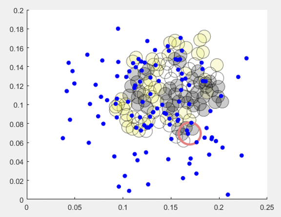

# BeeNestABM
Bee Nest Agent-Based Model: Agent-based model of spatiotemporal distribution of bumblebees in nests

NEED TO UPDATE AFTER James' in silico experiment codes are pushed

## Overview
The purpose of this agent-based model is to track the movements of individual bees within a nest chamber on relatively short time scales (a few seconds to less than one day) considering interactions with nestmates and nest structures such as food or brood pots. The entities are the bumblebees. The states at each time step are the x- and y-coordinates of each bee, the velocity, the activity state,
and the directional heading angle. The default scales are the nestMaxX and nestMaxY settings set to 25 cm and 20 cm, respectively for the dimensions of the nest. The time scale is 0.5 second per time step for a typically simulation duration of 500-3600 seconds.

### Authors
James D. Crall, Department of Organismic and Evolutionary Biology, Harvard University, jcrall@oeb.harvard.edu

Biswadip Dey, Department of Mechanical & Aerospace Engineering, Princeton University, biswadip@princeton.edu

Ashlee N. Ford Versypt, School of Chemical Engineering, Oklahoma State University, ashleefv@okstate.edu

### Main files
   
* inSilicoExp_Working.m.
    Script to adjust input parameters for spontaneous and social transitions between 
    active/inactive states, run the simulation via simulationOutputSpatial.m, and 
    analyze the statistics via calculateSummaryStatistics.m.

OR

* optimizerShellSpatial.m
    Function to estimate the unknown parameters (attraction coefficients) using 
    empirically derived values for the transition probabilities and 
    simulationOutputSpatial.m comparing the model output to the data via all 
    metrics from calculateSummaryStatistics.m.

OR

* localSensitivity.m
  Runs the full model with the optimized parameter cases when sensitivity = 0 and 
  analyzes the statistics via calculateSummaryStatistics.m.. numberTrials indicates how many repeated simulations to run. For   numberTrials > 1, means and standard deviations are calculated for each output metric.
  
OR

* BeeAttractionApp/BeeAttraction.m
  MATLAB graphical user interface for educational purposes. It uses an older version of the ABM model where the bees are attracted environmental stimuli weight "attraction" is variable and is comprised of 10% each from the three types of nest structures and 70% from attraction to nestmates. This is no longer used in the production runs for scientific purposes; however, it does serve as a nice example of an agent-based model for educational outreach use.

### Dependent files
* simulationOutputSpatial.m.
   The function runs the model defined by rules.m for a user-defined number of time steps with the default parameters. This file s intended to be called by other scripts to repeat the simulation for determining statistics or to test the impacts of setting different parameter sets for parameter estimation, sensitivity analysis, or in silico experiments. Set vis = 1 to generate plots and videos of the output. Set vis = 0 to run without figures.
   
* rules.m.
NOT intended to be called directly. This function contains all of the rules of the agent-based model that are called at each time step. The rules include 
  1. checking whether or not bees are close enough for social interactions.
  2. transitioning between active (moving) and inactive (stationary) states.
  3. moving with some velocity and at some angle heading (0-2 pi in 2D) from the current position. 
    - velocity: Bees that were previously inactive are set at a velocity selected from the empirically determined distribution of bee velocities. Bees that were already moving have two options for velocities: if the resampled velocity from the distribution is +/- 20% of the current velocity, it is updated, but if the sample velocity is outside this range, then velocities have a 10% probability of switching to the sample value and 90 % probability of staying at the current velocity. 
    - angle: First, an angle perturbed within +/- pi/4 of the current angle heading is calculated as the random walk angle. Next, the pairwise distances between a bee and the collection of other nestmates and the nest structures (itemized by brood, empty food pots, and full food pots) are calculated along with the angles of the resultant total distance vectors for each category. The attractions to the nestmates and the nest structures are specified as attraction weights called lambda (the current values have all three types of nest structures lumped together and no attraction toward nestmates). These are collectively referred to as the  environmental stimuli. The net angle for the environmental stimuli is the mean in polar coordinates of the angles between each bee and the nestmates and structures in the nest weighted by their attraction lambda values. The net environmental stimuli angle and the random walk angle are combined by a weighted mean in poloar coordinates with the weight of the environmental stimuli set to different weights for different cohorts (default values stored in rules.m) and the random walk deviations weighted at 1-environmental stimuli weight. 
  4. truncating the bees movement if it hits the wall.
  5. updating all the states for the next iterations.
  
* calculateSummaryStatistics.m.
    Given a nestData object and the coordinates of the nest structures (brood and 
    food pots), the function returns the means over all   time and all bees and the 
    time averaged values for each of the bees for the following calculated metrics: 
    activity (moving or not), distance to other bees, distance to nest structures, 
    distance to the social center of the nest, and portion of time spent on the nest.
    
